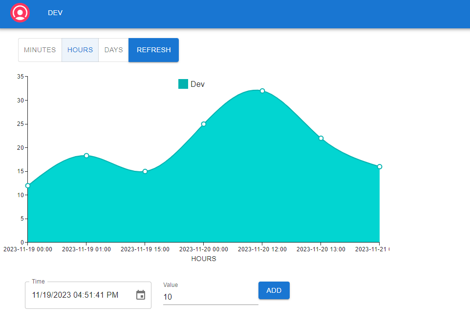
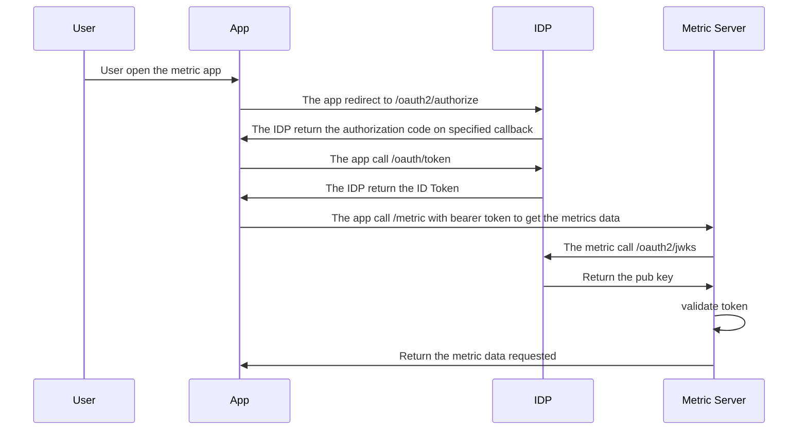
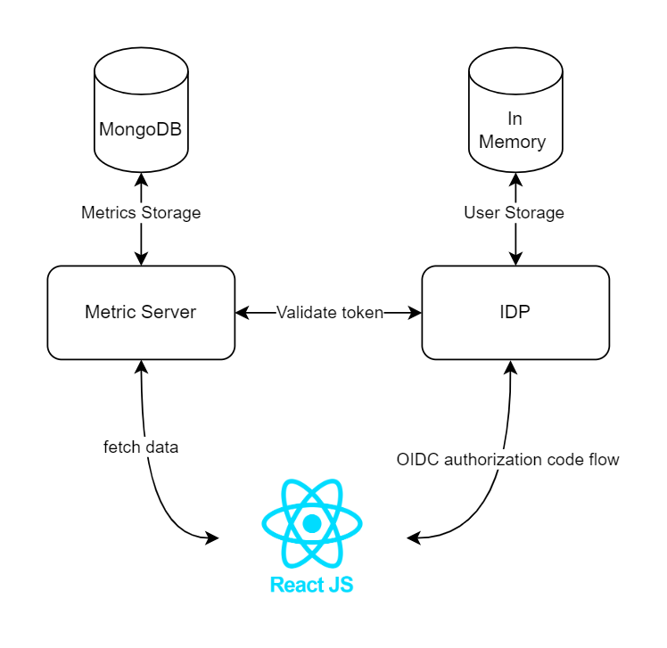

# Welcome to Metric Dashboard!

This is a dashboard where is possible to visualize and analyze metrics.

# Application

## Setup

To run the application is necessary doing:

- add on your file host this section

> 127.0.0.1		idp

- run this command

> docker-compose up --build

The application will be available on http://localhost:3000 and only for test you can use this credentials:
- username: factorial-admin
- password: password

## Technologies

To made this application have been used this technologies:

- [Spring Authorization Server](https://github.com/spring-projects/spring-authorization-server) to create the IDP
- [Spring Boot](https://spring.io/projects/spring-boot) to made the metric server
- [MongoDb and own time series collection](https://www.mongodb.com/docs/manual/core/timeseries-collections/) to persist the metrics.
- [React](https://react.dev/learn) and [Material UI](https://mui.com/material-ui/getting-started/) for the frontend layer

## Sequence diagrams

